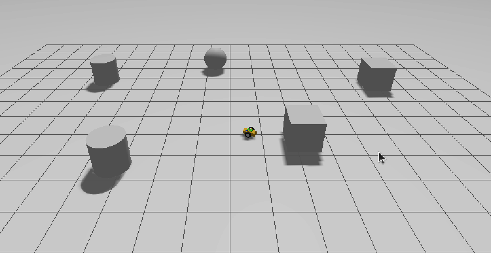

# Assignment 2 - Research Track

A ROS2 (Robot Operating System 2) project implementing a robot distance controller with user interface for velocity command management. The system features collision avoidance, dynamic threshold adjustment, and real-time robot information publishing.



## Table of Contents

- [Overview](#overview)
- [System Architecture](#system-architecture)
- [Prerequisites](#prerequisites)
- [Installation](#installation)
- [Building the Project](#building-the-project)
- [Running the Project](#running-the-project)
- [Custom Interfaces](#custom-interfaces)
- [Usage Guide](#usage-guide)

## Overview

This project consists of two main ROS2 nodes that work together to provide safe robot navigation:

1. **UI Node** - Handles user input, velocity command management, and provides average velocity calculation services
2. **Distance Controller Node** - Processes laser scan data for obstacle detection, manages collision avoidance, and publishes robot information

## System Architecture

### Nodes

#### 1. UI Node (`ui_node`)

**Publishers:**
- `/bridge_vel` (geometry_msgs/Twist) - Publishes velocity commands to the controller

**Services (Server):**
- `/average_velocity` (custom_interface/AverageVel) - Calculates and returns the average linear and angular velocities from stored commands

**Services (Client):**
- `/set_treshold` (custom_interface/Treshold) - Sets the distance threshold for collision detection

**Functionality:**
- Collects velocity commands from user input (linear and angular)
- Stores up to 5 recent velocity commands
- Publishes commands for 3 seconds at 50Hz (20ms intervals)
- Provides service to calculate average velocities
- Allows dynamic threshold adjustment

#### 2. Distance Controller Node (`controller_node`)

**Publishers:**
- `/cmd_vel` (geometry_msgs/Twist) - Publishes final velocity commands to the robot
- `/info` (custom_interface/InfoRobot) - Publishes robot status information at 10Hz

**Subscribers:**
- `/scan` (sensor_msgs/LaserScan) - Receives laser scan data for obstacle detection
- `/bridge_vel` (geometry_msgs/Twist) - Receives velocity commands from UI node

**Services (Server):**
- `/set_treshold` (custom_interface/Treshold) - Updates the collision detection threshold

**Functionality:**
- Monitors minimum distance to obstacles using laser scan data
- Compares minimum distance against configurable threshold (default: 0.5m)
- Publishes commands if safe, otherwise reverses robot direction
- Publishes real-time information about distance, threshold, and obstacle direction
- Prevents robot movement after collision until explicit stop command received

### Communication Flow

```
User Input → UI Node → /bridge_vel → Controller Node → /cmd_vel → Robot
                ↓                            ↓
         /average_velocity            /info (status)
                                             ↓
                                      Distance/Direction
                                         Monitoring
```

### Topic Details

| Topic | Message Type | Publisher | Subscriber | Purpose |
|-------|-------------|-----------|------------|---------|
| `/bridge_vel` | geometry_msgs/Twist | ui_node | controller_node | Transfer user velocity commands |
| `/cmd_vel` | geometry_msgs/Twist | controller_node | Robot | Final velocity commands |
| `/scan` | sensor_msgs/LaserScan | Robot/Sensor | controller_node | Laser scan data |
| `/info` | custom_interface/InfoRobot | controller_node | - | Robot status information |

### Service Details

| Service | Type | Server | Client | Purpose |
|---------|------|--------|--------|---------|
| `/average_velocity` | custom_interface/AverageVel | ui_node | - | Calculate average velocities |
| `/set_treshold` | custom_interface/Treshold | controller_node | ui_node | Update collision threshold |

## Prerequisites

- **ROS2 Distribution**: Tested with ROS2 Humble/Foxy or later
- **Operating System**: Ubuntu 20.04/22.04 or compatible Linux distribution
- **Dependencies**:
  - rclcpp
  - geometry_msgs
  - sensor_msgs
  - std_msgs

## Installation

### 1. Create a ROS2 Workspace

```bash
mkdir -p ~/ros2_ws/src
cd ~/ros2_ws/src
```

### 2. Clone the Repository

```bash
# Clone the custom interface package
git clone https://github.com/antozerba/custom_interface.git

# Clone the main assignment package
git clone https://github.com/antozerba/assignment2_rt.git

# Clone the main gazebo simulation world
git clone https://github.com/CarmineD8/bme_gazebo_sensors.git

```


## Building the Project

### Build Both Packages

```bash
cd ~/ros2_ws
colcon build 
```

### Source the Workspace

```bash
source ~/ros2_ws/install/setup.bash
```

**Note:** Add this line to your `~/.bashrc` to automatically source the workspace:

```bash
echo "source ~/ros2_ws/install/setup.bash" >> ~/.bashrc
```

## Running the Project

### Terminal 0: Launch the Gazebo Simulation

```bash
source ~/ros2_ws/install/setup.bash
ros2 launch bme_gazebo_sensors spawn_robot.launch.py 

```


### Terminal 1: Launch the Distance Controller Node

```bash
source ~/ros2_ws/install/setup.bash
ros2 run assignment2_rt controller
```

### Terminal 2: Launch the UI Node

```bash
source ~/ros2_ws/install/setup.bash
ros2 run assignment2_rt ui
```


## Custom Interfaces

### Messages

#### InfoRobot.msg
```
float32 distance    # Minimum distance to obstacle
string direction    # Direction of nearest obstacle (FRONT/BACK/LEFT/RIGHT)
float32 tresh       # Current collision threshold
```

### Services

#### AverageVel.srv
```
---
float32 avg_lin    # Average linear velocity
float32 avg_ang    # Average angular velocity
```

#### Treshold.srv
```
float32 input_tresh    # New threshold value (must be > 0)
---
char ack              # Acknowledgment ('1' = success, '0' = failure)
```

## Usage Guide

### Setting Velocity Commands

When the UI node is running, you'll be prompted:

```
Do you want to set a new treshold? (y/n): n
Insert Linear Vel: 
0.5
Insert Angular Vel: 
0.0
```

- **Linear velocity** (m/s): Forward/backward motion (positive = forward)
- **Angular velocity** (rad/s): Rotational motion (positive = counter-clockwise)

### Changing the Collision Threshold

```
Do you want to set a new treshold? (y/n): y
Insert new treshold (float > 0): 
0.8
```

The threshold defines the minimum safe distance to obstacles in meters.

### Behavior

1. **Normal Operation**: Commands are published for 3 seconds, then the robot stops
2. **Collision Detection**: If obstacle distance < threshold, robot reverses automatically
3. **Command History**: UI node stores the last 5 velocity commands
4. **Safety**: After collision, robot remains stopped until receiving an explicit stop command (0, 0)

### Monitoring Robot Status

Subscribe to the info topic to see real-time status:

```bash
ros2 topic echo /info
```

### Calling the Average Velocity Service

```bash
ros2 service call /average_velocity custom_interface/srv/AverageVel
```

## Project Structure

```
assignment2_rt/
├── src/
│   ├── ui_node.cpp                 # User interface node
│   └── distance_controller.cpp     # Distance controller node
├── CMakeLists.txt
└── package.xml

custom_interface/
├── msg/
│   └── InfoRobot.msg              # Robot information message
├── srv/
│   ├── AverageVel.srv             # Average velocity service
│   └── Treshold.srv               # Threshold setting service
├── CMakeLists.txt
└── package.xml
```

## Key Features

- **Collision Avoidance**: Automatic obstacle detection and avoidance
- **Dynamic Threshold**: Runtime adjustment of safety distance
- **Command History**: Tracks recent velocity commands for analysis
- **Information Publishing**: Real-time robot status broadcasting
- **Service Interface**: Calculate average velocities on demand
- **Safety First**: Preventive measures after collision detection

## Troubleshooting

### Build Errors

If you encounter build errors:

```bash
# Clean the build
cd ~/ros2_ws
rm -rf build install log

# Rebuild
colcon build --packages-select custom_interface assignment2_rt
```

### Node Communication Issues

Check if topics are publishing:

```bash
ros2 topic list
ros2 topic echo /bridge_vel
ros2 topic echo /cmd_vel
```

Check if services are available:

```bash
ros2 service list
ros2 service type /set_treshold
```

### Laser Scan Not Detected

Ensure your robot or simulator is publishing to the `/scan` topic:

```bash
ros2 topic info /scan
ros2 topic hz /scan
```

## License

[Specify your license here]

## Author

**Maintainer**: anto  
**Email**: antozerba28@gmail.com

## Acknowledgments

- ROS2 community
- Research Track course materials